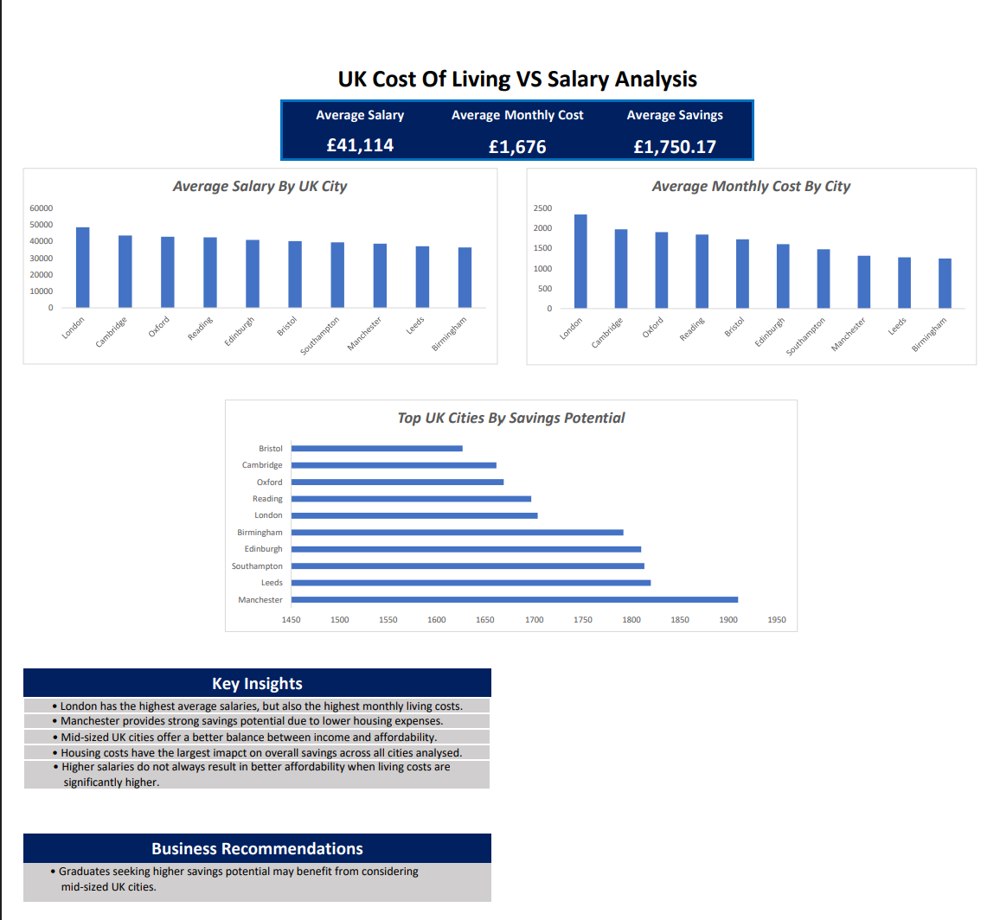

# UK Cost Of Living VS Salary Analysis
## Project Overview
This project analyses salary levels, living costs and savings potential across major UK cities using Excel.
## Objectives
- Compare salaries across major UK cities
- Analyse monthly living expenses
- Identify savings potentil
- Generate business insights
## Tools Used
- Excel
- Data Cleaning
- Data Visualisarion
- Pivot Charts
## Key Insights
- London has the highest salaries and living costs
- Manchester offers strong savings potential
- Mid-sized cities provide better affordability
## Dashboard Preview

## Business Recommendations
- Graduates and professionals may benefit from considering cities with lower housing costs and better affordability balance.
## Author
Naveenraj

Aspiring Data Analyst

